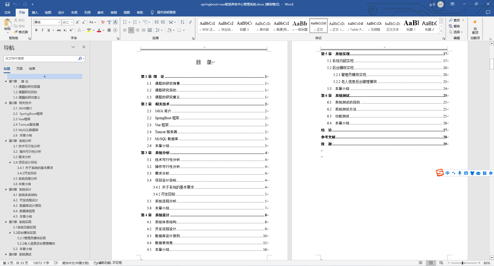
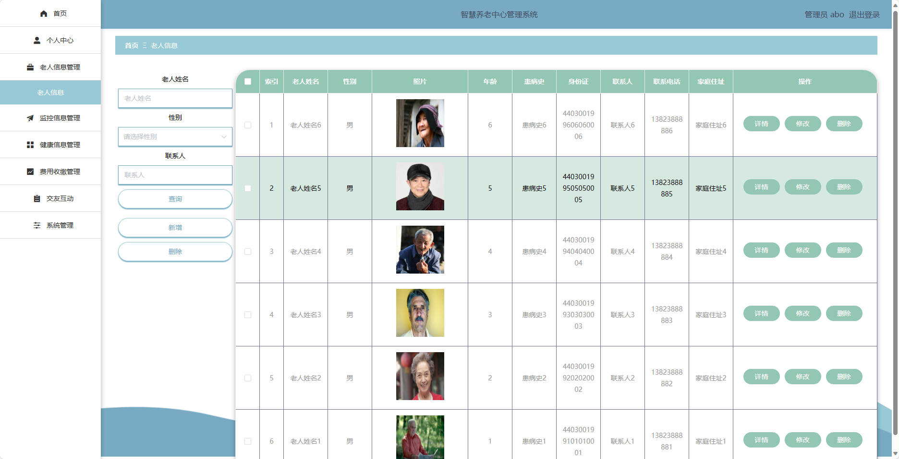
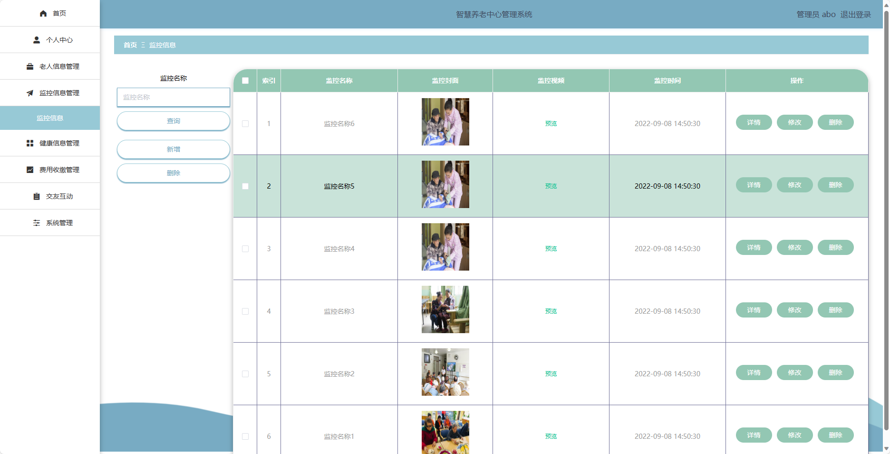
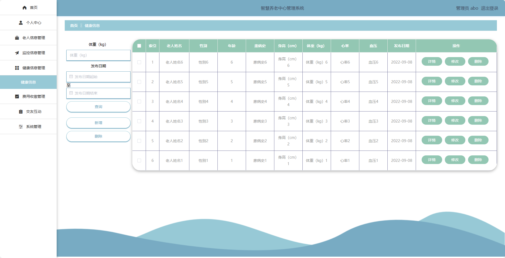
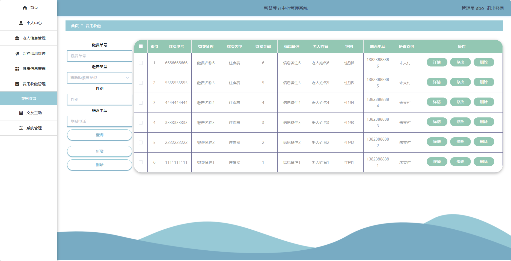
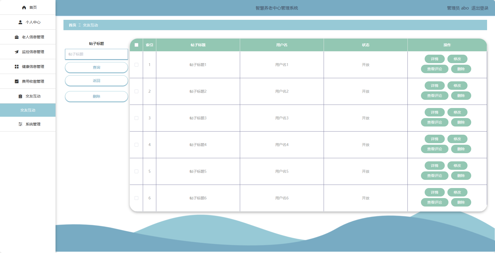
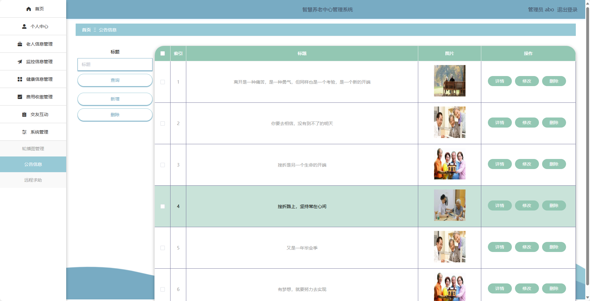
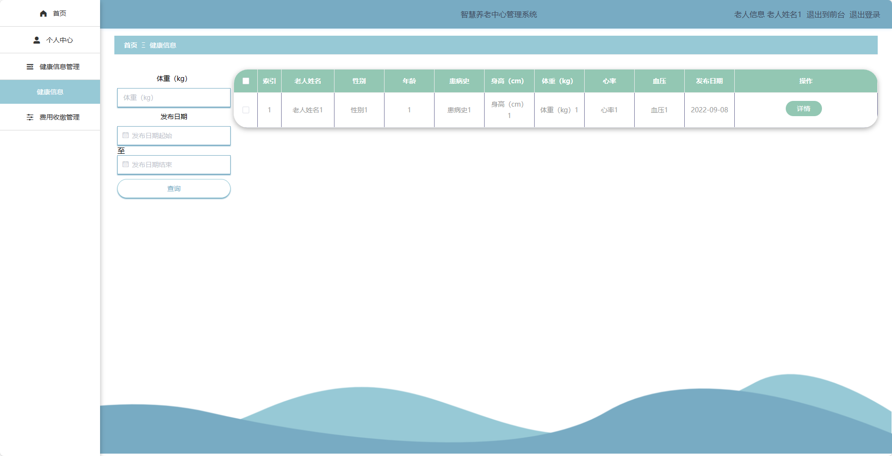
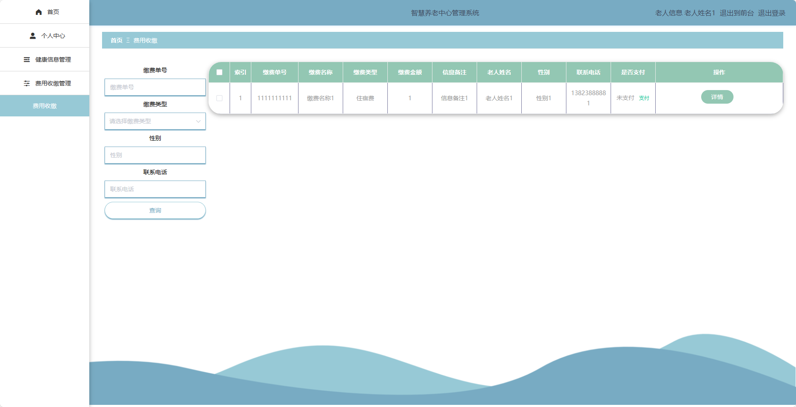

基于SpringBoot的智慧养老中心管理系统（程序+论文）
=
- 完整代码获取地址：从戎源码网 ([https://armycodes.com/](https://armycodes.com/))
- 作者微信：19941326836  QQ：952045282 
- 承接计算机毕业设计、Java毕业设计、Python毕业设计、深度学习、机器学习
- 选题+开题报告+任务书+程序定制+安装调试+论文+答辩ppt 一条龙服务
- 所有选题地址https://github.com/nature924/allProject

一、项目介绍
---
基于Spring Boot框架实现的智慧养老中心管理系统，系统包含两种角色：管理员、用户，主要功能如下。

### 管理员角色：
- 个人中心：管理员可以管理个人信息，修改密码等。
- 老人信息管理：管理员可以管理老人的基本信息，包括添加、编辑和删除老人信息。
- 监控信息管理：管理员可以管理监控设备的信息，包括添加、编辑和删除监控设备信息。
- 健康信息管理：管理员可以管理老人的健康信息，包括添加、编辑和删除健康信息。
- 费用收缴管理：管理员可以管理老人的收费信息，包括查看和修改收费信息。
- 交友互动：管理员可以为老人提供交友互动平台，包括发布话题、评论回复等。
- 系统管理：管理员可以管理系统的相关配置，包括日志管理、权限管理等。
- 轮播图管理：管理员可以管理轮播图的展示内容，包括添加、编辑和删除轮播图信息。
- 公告信息：管理员可以发布公告信息。
- 远程求助：管理员可以为老人提供远程求助服务。

### 老人角色：
- 个人中心：老人可以管理个人信息，查看个人健康信息，修改密码等。
- 健康信息管理：老人可以输入自己的健康状况。
- 费用收缴管理：老人可以查看自己的收费信息。

二、项目技术
---
- 编程语言：Java
- 数据库：MySQL
- 项目管理工具：Maven
- 前端技术：VUE、HTML、Jquery、Bootstrap
- 后端技术：Spring、SpringMVC、MyBatis

三、运行环境
---
- 操作系统：Windows、macOS都可以
- JDK版本：JDK1.8以上都可以
- 开发工具：IDEA、Ecplise、Myecplise都可以
- 数据库: MySQL5.7以上都可以
- Tomcat：任意版本都可以
- Maven：任意版本都可以

四、运行截图
---
### 论文截图：

### 程序截图：

